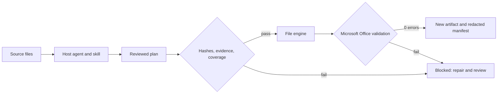

**English** · [中文](README.zh-CN.md)

<div align="center">

# Research Workflow Skills

**An agent can propose a result. Code decides whether the file can be delivered.**

[](https://github.com/frankglendon/research-workflow-skills/actions/workflows/test.yml)


[Run the demo](#run-it) · [Architecture](docs/architecture.md) · [Interview guide](docs/interview.md)

</div>

A public engineering portfolio: one coordinating entrypoint and six specialist skills turn reviewed plans into Excel and PowerPoint files. Missing reviews, stale inputs, fabricated source excerpts and changed numeric tokens block delivery. Every successful export includes an audit manifest and passes Microsoft's Open XML SDK validator.

The host agent performs reasoning and review. This repository provides skill instructions and executable file contracts. Its demo uses **prewritten synthetic reviews and zero model calls**, making it runnable without API credentials.

## See the behavior

```text
$ python -m research_skills demo --output .runs/demo
{"synthetic": true, "model_calls": 0, "exports": 5,
 "openxml_errors": 0, "fabricated_quote": "blocked"}
```

[Download the synthetic demo bundle](https://github.com/frankglendon/research-workflow-skills/releases/tag/v0.1.0) or reproduce it locally. The bundle includes source fixtures, reviewed plans, five Office outputs and their manifests.

| Skill | Runnable scope | Example refusal |
|---|---|---|
| Survey QC | Three-column survey, row review, preserved source cells | One required row is unreviewed |
| Evidence report | Reviewed claims and excerpts → editable PPT | Quote is absent from source text |
| Data binding | Explicit Excel cells → one PPT chart series | Mapping unconfirmed or source cell empty |
| Questionnaire | 10 structured types, analysis and programming sheets → Excel | Missing route coverage or stale review |
| Codebook | Variable dictionary, Datamap, open coding definitions | Questionnaire changed after codebook review |
| Slide translation | All slide text runs → translated PPT | `100` becomes `900` |


The preview is rendered from the downloadable demo output. [Evidence report](docs/assets/02-evidence-report.png) · [Translated slide](docs/assets/05-translated-slide.png).

Run the additional survey/codebook demo with `python -m research_skills survey-demo --output .runs/survey-demo`. It produces two linked workbooks from 7 synthetic questions, 13 variables and 2 routing cases. The original five-output demo remains available. The coordinating skill is a host workflow, not an independent agent process.

The coordinator also uses a [ten-type study taxonomy](skills/research-workflow/references/project-types.md) to separate business decisions, research methods and delivery stages. A [synthetic study record](skills/research-workflow/references/study.example.json) shows how to preserve unresolved scope and capability gaps. These are planning instructions, not an automatic classifier or statistical analysis engine.


[Questionnaire preview](docs/assets/07-questionnaire.png) · [Datamap preview](docs/assets/06-datamap.png).

## Why this project is worth reviewing

- **Trust boundaries in code.** Review declarations are bound to input and plan hashes; prompt instructions alone cannot make an invalid export succeed.
- **Inspectable failure behavior.** Adversarial tests exercise refusals and ensure that blocked runs leave no final artifact or manifest.
- **File integrity as a release condition.** Inputs remain unchanged; Office validation runs before no-overwrite output publication.
- **Measured learning scope.** The optional SkillOpt adapter stages candidates behind a no-regression gate. Its small decision datasets do not measure research accuracy.



## Run it

Prerequisites: Python 3.12 and the [.NET 10 SDK](https://dotnet.microsoft.com/en-us/download/dotnet/10.0). Initial dependency installation needs network access. No web server, API key or employer template is required.

```bash
git clone https://github.com/frankglendon/research-workflow-skills.git
cd research-workflow-skills
python3.12 -m venv .venv
source .venv/bin/activate
pip install -e . -c constraints-py312.txt
python -m research_skills demo --output .runs/demo
python -m unittest discover -s tests -v
```

On Windows, use `py -3.12 -m venv .venv` and `.venv\Scripts\Activate.ps1`. Linux CI tests the same commands. Choose a fresh output directory when rerunning the demo.

Optional host installation: `python install_skills.py` links the seven skill entrypoints into Codex. Use `--target PATH` for another compatible host. On Windows, symlink creation requires appropriate privileges. Keep the checkout at its installed location; scripts use its `.venv`.

## Inspect the implementation

Start with [contracts.py](research_skills/contracts.py), [workflows.py](research_skills/workflows.py), [artifacts.py](research_skills/artifacts.py) and [behavior tests](tests/test_workflows.py). [Plan protocols](docs/protocols.md) explain the JSON boundary; [SkillOpt](docs/skillopt.md) explains candidate evaluation and adoption.

This is a focused public reconstruction with generic rules and synthetic assets. It excludes employer branding, private business rules, client materials, credentials and private repository history. It does not claim autonomous web research, independently verified semantics, production deployment metrics or accuracy on real client data. A matching quote is not proof of entailment, and a review flag is a host declaration. Visual inspection remains necessary.

See [validation and limitations](docs/validation.md) for the actual checks and scope. AI-assisted implementation; the design decisions, code and tests are exposed for inspection.
