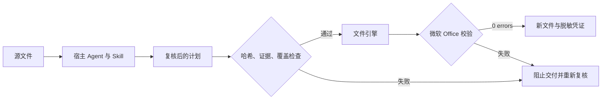

[English](README.md) · **中文**

<div align="center">

# Research Workflow Skills

**Agent 提出结果，代码决定文件是否可以交付。**

[](https://github.com/frankglendon/research-workflow-skills/actions/workflows/test.yml)


[运行演示](#运行演示) · [架构设计](docs/architecture.md) · [面试讲解](docs/interview.zh-CN.md)

</div>

面向 AI 应用工程岗位的公开作品集：五个由宿主 Agent 调用的 Skill，将经过复核的计划转换为 Excel 和 PowerPoint。漏审、输入变更、伪造引用、翻译篡改数字等情况会阻止导出；成功文件附脱敏凭证，并通过微软 Open XML SDK 校验。

宿主负责推理和语义复核，项目提供技能流程与可执行文件契约。演示使用**预先编写的合成复核结果，模型调用为 0**，无需 API 密钥即可验证代码行为。

```text
$ python -m research_skills demo --output .runs/demo
{"synthetic": true, "model_calls": 0, "exports": 5,
 "openxml_errors": 0, "fabricated_quote": "blocked"}
```

[下载合成演示包](https://github.com/frankglendon/research-workflow-skills/releases/tag/v0.1.0)：包含输入样例、复核计划、五份 Office 输出和运行凭证，也可按下文自行生成。

| 技能 | 本版可运行范围 | 拦截示例 |
|---|---|---|
| 问卷 QC | 三列问卷、逐行复核、保留原始单元格 | 漏审一行 |
| 证据报告 | 已复核断言与源文片段 → 可编辑 PPT | 引用不在源文中 |
| 数据贴数 | 明确的 Excel 单元格 → 单系列 PPT 图表 | 映射未确认或源单元格为空 |
| 问卷设计 | 单选、开放题、NPS → Excel | 跳转目标不存在或刻度不完整 |
| 幻灯片翻译 | 全部页面文本单元 → 翻译 PPT | `100` 被改成 `900` |


预览图直接由可下载的演示文件渲染。[证据报告](docs/assets/02-evidence-report.png) · [翻译页面](docs/assets/05-translated-slide.png)。

## 值得关注的工程设计

- **代码约束信任边界**：复核与输入、计划哈希绑定；提示词不能代替程序门禁。
- **失败路径可验证**：反例测试不仅检查报错，也检查失败后没有最终文件和成功凭证。
- **文件完整性决定交付**：原始输入不覆盖，微软校验通过后才发布新文件。
- **优化效果有明确口径**：SkillOpt 接入采用候选暂存和逐例防退化；小样本决策题不冒充研究准确率。



## 运行演示

需要 Python 3.12 和 [.NET 10 SDK](https://dotnet.microsoft.com/en-us/download/dotnet/10.0)。首次安装依赖需要联网。无需启动网站、填写模型密钥或提供公司模板。

```bash
git clone https://github.com/frankglendon/research-workflow-skills.git
cd research-workflow-skills
python3.12 -m venv .venv
source .venv/bin/activate
pip install -e . -c constraints-py312.txt
python -m research_skills demo --output .runs/demo
python -m unittest discover -s tests -v
```

Windows 使用 `py -3.12 -m venv .venv` 和 `.venv\Scripts\Activate.ps1`。Linux CI 执行同样的核心命令。重复演示时指定新的输出目录。

可选安装：`python install_skills.py` 将技能链接到 Codex；其他宿主用 `--target PATH` 指定目录。Windows 符号链接需要相应权限。安装后保留仓库位置，入口脚本使用仓库的 `.venv`。

## 阅读代码

建议从 [contracts.py](research_skills/contracts.py)、[workflows.py](research_skills/workflows.py)、[artifacts.py](research_skills/artifacts.py) 和 [行为测试](tests/test_workflows.py) 入手。[计划协议](docs/protocols.md) 解释 JSON 边界，[SkillOpt 文档](docs/skillopt.md) 解释评测与采用。

这是使用通用规则和合成资产构建的公开展示版，不包含雇主品牌、内部业务规则、客户资料、凭据或私有仓库历史。它不宣称已实现无人值守联网研究、独立模型验真、生产部署收益或真实客户数据准确率。原文匹配不能证明结论成立，复核标记只是宿主声明；最终仍需要语义和视觉检查。

实际证据见 [验收与边界](docs/validation.md)。实现过程使用了 AI 辅助；设计取舍、源代码与测试均可检查。
