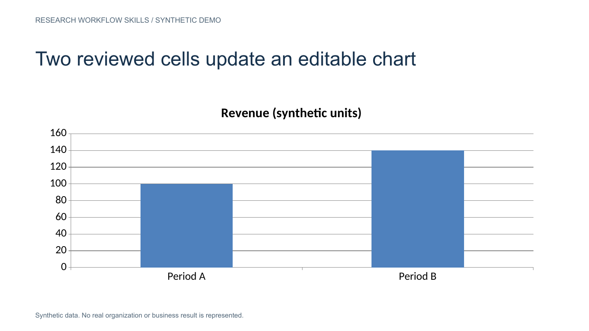
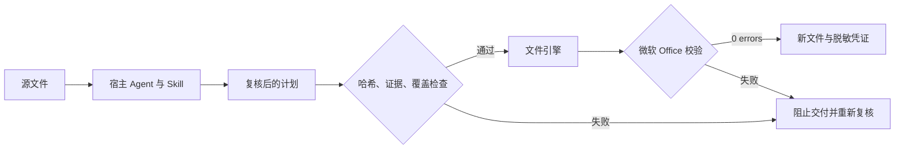

[English](README.md) · **中文**

<div align="center">

# Research Workflow Skills

**Agent 提出结果，代码决定文件是否可以交付。**

[](https://github.com/frankglendon/research-workflow-skills/actions/workflows/test.yml)


[运行演示](#运行演示) · [架构设计](docs/architecture.md) · [面试讲解](docs/interview.zh-CN.md)

</div>

面向 AI 应用工程岗位的公开作品集：一个总入口与七个专业 Skill，覆盖整体研究设计和已复核的文件流程。方案设计由宿主完成；六个文件引擎输出 Excel 和 PowerPoint。漏审、输入变更、伪造引用、翻译篡改数字等情况会阻止引擎导出；引擎成功输出附脱敏凭证，并通过微软 Open XML SDK 校验。

宿主负责推理和语义复核，项目提供技能流程与可执行文件契约。演示使用**预先编写的合成复核结果，模型调用为 0**，无需 API 密钥即可验证代码行为。

**案头流程重建（0.6.0）：**[当前案头案例](examples/north-america-retail/desk-v3/README.zh-CN.md)补齐问题驱动的逐章研究、竞品与国家分析、反证及整册审稿。v2案头分析深度不足，保留为历史；问卷与码表仍在[v2研究包](examples/north-america-retail/professional-v2/README.zh-CN.md)。文件有效性和测试数量不认证研究质量。

**Tavily 优先检索（0.4.0）：**案头 Skill 已接入请求状态保存、逐页原文、限额退避和本地候选片段检索；Firecrawl 保留为显式单页备选。见 [实现与边界](docs/retrieval.md)，或运行 `python examples/retrieval/reproduce.py --output .runs/retrieval-demo` 查看无需联网的合成演示。

**v1历史设计案例：**[北美零售研究](examples/north-america-retail/README.zh-CN.md)，包含 23 页定性与定量方案、访谈指南、54 节点问卷和 120 变量码表。案例目录可直接下载 Word、Excel，也可[一次下载全部代码与成品](https://github.com/frankglendon/research-workflow-skills/releases/tag/case-study-v1)。虚构品牌与合成路径用于展示设计交接，没有实地研究或市场发现。

```bash
python examples/north-america-retail/reproduce.py --output .runs/full-case
```

复现会重新编译两份工作簿、验证随包 Word，并回放三个设计阶段；12 条合成用例覆盖 56 个显式分支。它复用已记录的宿主审阅，不重新生成方案或开展研究。

```text
$ python -m research_skills demo --output .runs/demo
{"synthetic": true, "model_calls": 0, "exports": 5,
 "openxml_errors": 0, "fabricated_quote": "blocked"}
```

[下载合成演示包](https://github.com/frankglendon/research-workflow-skills/releases/tag/v0.1.0)：包含输入样例、复核计划、五份 Office 输出和运行凭证，也可按下文自行生成。

| 技能 | 支持范围 | 复核或拦截示例 |
|---|---|---|
| 整体方案设计 | 宿主编写定性与定量方案、抽样和分析计划 | 范围未定时保留假设，不宣称已批准实地执行 |
| 问卷 QC | 三列问卷、逐行复核、保留原始单元格 | 漏审一行 |
| 证据报告 | 已复核断言与源文片段 → 可编辑 PPT | 引用不在源文中 |
| 数据贴数 | 明确的 Excel 单元格 → 单系列 PPT 图表 | 映射未确认或源单元格为空 |
| 问卷设计 | 10 种结构化题型、分析与编程表 → Excel | 路径覆盖不足或复核版本过期 |
| 码表设计 | 变量字典、Datamap、开放题编码框架 | 问卷变更但码表未更新 |
| 幻灯片翻译 | 全部页面文本单元 → 翻译 PPT | `100` 被改成 `900` |



预览图直接由可下载的演示文件渲染。[证据报告](docs/assets/02-evidence-report.png) · [翻译页面](docs/assets/05-translated-slide.png)。

新增问卷与码表演示：`python -m research_skills survey-demo --output .runs/survey-demo`，生成同版本问卷和码表两份工作簿。它使用合成的 7 道题、13 个变量和 2 条路径用例。旧版五文件演示保留不变。

分工与落地建议见 [结构概述](docs/structure.zh-CN.md)。共八个入口，其中 `research-workflow` 负责宿主调度；这些入口不代表八个独立 Agent。

总入口新增 [10 类研究项目分类与选流程规则](skills/research-workflow/references/project-types.md)，分开记录商业目标、研究方法与交付环节。[合成项目记录](skills/research-workflow/references/study.example.json) 展示范围与能力缺口的保留方式。这是宿主规划能力，未新增自动分类器或统计分析引擎。


[问卷实际预览](docs/assets/07-questionnaire.png) · [Datamap 实际预览](docs/assets/06-datamap.png)。

## 值得关注的工程设计

- **代码约束信任边界**：复核与输入、计划哈希绑定；提示词不能代替程序门禁。
- **失败路径可验证**：反例测试不仅检查报错，也检查失败后没有最终文件和成功凭证。
- **文件完整性决定交付**：原始输入不覆盖，微软校验通过后才发布新文件。
- **优化效果有明确口径**：SkillOpt 接入采用候选暂存和逐例防退化；小样本决策题不冒充研究准确率。



## 运行演示

需要 Python 3.12 和 [.NET 10 SDK](https://dotnet.microsoft.com/en-us/download/dotnet/10.0)。首次安装依赖需要联网。无需启动网站、填写模型密钥或提供公司模板。

```bash
git clone https://github.com/frankglendon/research-workflow-skills.git
cd research-workflow-skills
python3.12 -m venv .venv
source .venv/bin/activate
pip install -e . -c constraints-py312.txt
python -m research_skills demo --output .runs/demo
python -m unittest discover -s tests -v
```

Windows 使用 `py -3.12 -m venv .venv` 和 `.venv\Scripts\Activate.ps1`。Linux CI 执行同样的核心命令。重复演示时指定新的输出目录。

可选安装：`python install_skills.py` 将技能链接到 Codex；其他宿主用 `--target PATH` 指定目录。Windows 符号链接需要相应权限。安装后保留仓库位置，入口脚本使用仓库的 `.venv`。

## 阅读代码

建议从 [contracts.py](research_skills/contracts.py)、[workflows.py](research_skills/workflows.py)、[artifacts.py](research_skills/artifacts.py) 和 [行为测试](tests/test_workflows.py) 入手。[计划协议](docs/protocols.md) 解释 JSON 边界，[SkillOpt 文档](docs/skillopt.md) 解释评测与采用。

这是使用通用规则和合成资产构建的公开展示版，不包含雇主品牌、内部业务规则、客户资料、凭据或私有仓库历史。它不宣称已实现无人值守联网研究、独立模型验真、生产部署收益或真实客户数据准确率。原文匹配不能证明结论成立，复核标记只是宿主声明；最终仍需要语义和视觉检查。

实际证据见 [验收与边界](docs/validation.md)。实现过程使用了 AI 辅助；设计取舍、源代码与测试均可检查。

## 项目进度与恢复（0.3.0）

总入口现在可以把跨阶段任务保存到本地 SQLite。重新进入任务时先读取状态，继续当前环节；上游问卷、方案或文件改变后，相关下游交付会显示为过期，需要重新生成和复核。完成阶段必须有与当前文件绑定的逐项通过记录。

```bash
python -m research_skills study-demo --output .runs/study-demo --repeats 3
```

这个演示覆盖六类流程行为，每类运行三次，使用合成文件与预写复核，模型调用为 0。真实项目的初始化、提交和恢复命令见 [阶段使用说明](skills/research-workflow/references/runtime.md)。状态保存在项目工作目录内，不随仓库分发。

它是宿主调用的状态与验收模块；仍需宿主进行研究、调用工具和语义复核。不同执行编号只是宿主声明，不能证明独立模型验真。模块约束登记阶段的完成，不接管所有旧文件导出命令。
